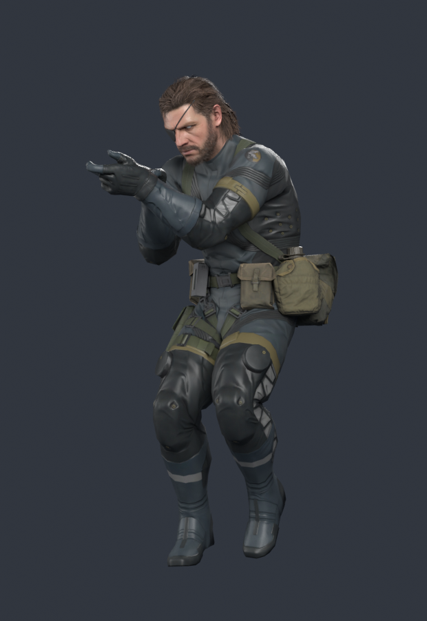
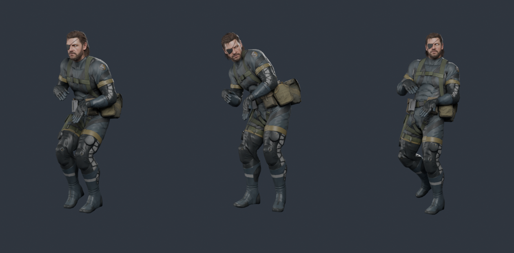

# foxanimrip

**Bulk animation export for Fox Engine games, plus a Blender importer that
knows what to do with the results.**

[FoxBrowser](https://www.nexusmods.com/metalgearsolidvtpp/mods/2531) can rip a
character out of MGSV with the animation that happens to be playing — one clip
per rip. `foxanimrip` drives the same code headlessly, so you can pull *every*
animation that fits a character in one go. For Snake in Ground Zeroes that is
about 3,900 clips across 13 animation sets, and it takes seconds per set.

The companion Blender add-on imports the model with its materials wired up
properly, and turns a folder of exported clips into an Action library.

| Model import | Animation import |
| --- | --- |
|  |  |

*Left: `sna2_main0_def` imported by the add-on, no hand-fixing. Right: frames
30 / 80 / 130 of `enemasr_s_run_f_r_ed_bl`, exported by `foxanimrip` and
imported as an Action.*

---

## Contents

- [What you need](#what-you-need)
- [Quick start](#quick-start)
- [Command line](#command-line)
- [How it works](#how-it-works)
- [Is it independent of FoxBrowser?](#is-it-independent-of-foxbrowser)
- [Portability](#portability)
- [What it fixes](#what-it-fixes)
- [Game support](#game-support)
- [The Blender add-on](#the-blender-add-on)
- [Building from source](#building-from-source)
- [Troubleshooting](#troubleshooting)
- [Limitations](#limitations)
- [Licence and credits](#licence-and-credits)

---

## What you need

* **Windows 10/11 64-bit** and the **.NET 10 Desktop Runtime** — the same one
  FoxBrowser needs, so if FoxBrowser runs, this runs.
* **FoxBrowser** itself, installed anywhere. `foxanimrip` reads what it needs
  out of your copy; nothing from FoxBrowser is bundled here.
* A **Fox Engine game** installed (Ground Zeroes, The Phantom Pain, …).
* **Blender 4.2 or newer**, if you want the add-on.

---

## Quick start

### 1. Install the Blender add-on

Download `io_foxbrowser-x.y.z.zip` from
[Releases](../../releases), then in Blender:
**Edit ▸ Preferences ▸ Add-ons ▸ ⌄ ▸ Install from Disk…**

### 2. Run foxanimrip

Unzip it somewhere **writable** — your Desktop is fine, `C:\Program Files` is
not — and double-click **`foxanimrip.exe`**.

The window walks through four steps:

```
1.  Which game        [ MGSV: Ground Zeroes  (3 archives)      ▾ ]  [Browse…] [Scan game files]
                      D:\Games\Metal Gear Solid V - Ground Zeroes

2.  Which characters  [ sna2                     ] [Select all shown] [Clear] [Use a .fmdl file…]
                      ┌──────────────────────────────────────────┐
                      │ sna2_face0_rain_cov                      │
                      │ sna2_main0_def                        ◀  │  ctrl-click
                      │ sna6_main0_def                        ◀  │  for several
                      └──────────────────────────────────────────┘
                      2 selected:  sna2_main0_def, sna6_main0_def

3.  Which animations  ( ) Everything that fits each character
                      (•) Only the sets I tick below   [Find animation sets]
                      ┌──────────────────────────────────────────┐
                      │ ☑ TppGzPlayer_layers  – 2406 clips, fits 2 │
                      │ ☑ SoldierGz_layers    – 1160 clips, fits 2 │
                      │ ☑ chico_layers        –  112 clips, fits 1 │
                      └──────────────────────────────────────────┘
                      Only clips whose name contains [          ]

4.  Where to save     [ C:\rips\anims                            ]  [Browse…]

           [ Export animations ]  [Stop]   ▓▓▓▓▓▓░░░░  1160 clips written
```

It finds your games and your FoxBrowser install on its own. The first scan of a
game indexes its archives (a few minutes for Phantom Pain, seconds for Ground
Zeroes) and is cached afterwards. The index is saved after every archive, so an
interrupted scan resumes rather than starting again. Dark theme by default; there is a Light and a
System option next to the other settings.

You never have to know what an `.fmdl` or an `.mtar` is.

**Several characters at once:** ctrl-click or shift-click in the character list.
Each one gets its own rig, its own compatibility check and its own output
folder — `<out>/<character>/<set>/<clip>.fbx`. The add-on knows about that
layout and will import only the folder matching the armature you have selected.

### 3. Bring it into Blender

1. **File ▸ Import ▸ FoxBrowser ▸ Model(s)…** — import the character once.
   Leave *Also export the character model* ticked and `foxanimrip` writes it for
   you, textures and all, so there is no separate FoxBrowser rip to do.
2. Select its armature.
3. **File ▸ Import ▸ FoxBrowser ▸ Animations onto Armature…** — point at the
   folder `foxanimrip` wrote.

One Action per clip, named after the clip, with fake users so the library
survives a save and reload.

> **The one setting that matters:** leave *Automatic Bone Orientation* **off**
> in both importers (it is off by default). Actions store *local* bone
> transforms — if the model and the clips disagree about bone orientation,
> every rotation lands in a different frame and the result is scrambled.

---

## Command line

`foxanimrip.exe` opens the window when double-clicked and behaves as a console
tool when given arguments. `foxanimrip-cli.exe` is the same thing without the
window (and is the build that runs on Linux and macOS).

```bat
foxanimrip --game gz --character sna2_main0_def --all --out C:\rips\anims
```

**Choosing the game**

| | |
| --- | --- |
| `--game <id>` | `gz`, `tpp`, `survive`, `custom`. Auto-detected if omitted. |
| `--root <folder>` | Folder holding the `.dat` / `.g0s` / `.qar` archives. Falls back to FoxBrowser's saved folder. |
| `--list-games` | Print the installs found, then exit. |

**Choosing the model**

| | |
| --- | --- |
| `--character <name>` | A model in the game, e.g. `sna2_main0_def`. Repeatable, and comma-separated lists work. Partial names work when unambiguous. |
| `--model <path>` | …or a loose `.fmdl`. FoxBrowser writes one into `<model>_source/` beside every rip. |
| `--list-models [text]` | Print the character models found, then exit. |

**Choosing the animations**

| | |
| --- | --- |
| `--mtar <file\|name>` | One animation archive, repeatable. |
| `--all` | Every animation archive in the game that fits the model. |
| `--list-mtars` | Print the compatible sets with clip counts, then exit. |

**Output**

| | |
| --- | --- |
| `--out <folder>` | Clips land in `<out>/<set>/<clip>.fbx`, plus an `index.tsv`. |
| `--filter <text>` | Only clips whose name contains this. |
| `--min-match <n>` | Bones a clip must drive to count. Default 8. |
| `--limit <n>` | Stop after n clips. |
| `--list` | Dry run — print what would be exported. |
| `--with-mesh` | Put the mesh in every clip file (see [Limitations](#limitations)). |
| `--step <n>` | Keep every nth frame. |
| `--fps <f>` | Default 59.94. |
| `--keep-static` | Also write clips where nothing moves. |
| `--dedupe [deg]` | Skip clips whose motion matches one already written, within [deg] degrees (default 0.5). |
| `--pack <n>` | Put n clips in each FBX as separate takes. 50 is a good number. |
| `--export-model` | Also rip the character itself — mesh, skeleton, materials, textures. |
| `--no-textures` | With `--export-model`, skip the textures. |

**Other**

| | |
| --- | --- |
| `--fb <path>` | `FoxBrowser.exe`. Auto-detected. |
| `--frig` / `--frdv` | Use a specific rig / help-bone file instead of searching. |
| `--rescan` | Ignore the cached index of the game files. |
| `--refresh` | Re-unpack FoxBrowser's assemblies after a FoxBrowser update. |
| `--portable` / `--no-portable` | Force where settings and caches live. |
| `--where` | Print those locations and exit. |
| `--no-fbx-fix` | Leave the broken animation class tokens alone. |
| `--quiet`, `-h` | |

Examples:

```bat
:: what would I get?
foxanimrip --character sna2_main0_def --list-mtars

:: one set
foxanimrip --character sna2_main0_def --mtar SoldierGz_layers --out C:\rips\anims

:: idle animations only, from everything that fits
foxanimrip --character sna2_main0_def --all --filter idl --out C:\rips\idles

:: several characters in one run (--limit applies per character)
foxanimrip --character sna2_main0_def,sna6_main0_def,paz0_main0_def --all --out C:\rips\anims

:: the whole job: model, textures and every animation, packed and de-duplicated
foxanimrip --character sna2_main0_def --export-model --all --dedupe --pack 50 --out C:\rips\snake
```

---

## How it works

`foxanimrip` **does not reimplement anything.** It reads the .NET single-file
bundle inside your own `FoxBrowser.exe`, unpacks the assemblies to a temp
folder, and calls the same entry points FoxBrowser's own "rip" button calls:

```csharp
var scene = ExportScene.Build(model, name);
scene.Clip = ExportBake.FromGani(model, gani, "take", drives, ikJobs, frig, helpBones);
File.WriteAllBytes(path, FbxExporter.Export(scene));
```

So the gani decode, the FRIG bone drives, the IK jobs and the FRDV help-bone
solve are FoxBrowser's, not an approximation of them — the output matches what
the GUI produces. Update FoxBrowser and this follows along; nothing from it is
redistributed here.

It also does the searching for you, the way the GUI does: it walks the archives
for the best-matching `.frig` and for `<model>.frdv`, and reads your game folder
out of FoxBrowser's own `%APPDATA%\FoxBrowser\settings.json` when you have not
said otherwise.

**Verified against a real Ground Zeroes install:** for `sna2_main0_def` it finds
a rig of 18 units / 56 segments and 32 help-bone operators — exactly the numbers
FoxBrowser's own `_rig.json` reports for that model — identifies 13 compatible
animation sets totalling ~3,900 clips (FoxBrowser's own UI reports "4004
compatible animations" for the same model), and exports all 1,160 clips of
`SoldierGz_layers.mtar` in about 12 seconds with no failures.

---

## Is it independent of FoxBrowser?

**No, and that is deliberate.** `foxanimrip` needs FoxBrowser installed. It is a
front end, not a fork.

Being independent would mean reimplementing the QAR/`.g0s` archive readers, the
FMDL parser, the compressed GANI decoder, the FRIG rig solve, the FRDV
help-bone operators and an FBX writer — essentially all of FoxBrowser. That is
months of work whose best possible outcome is *matching* what the existing
decoder already does, while quietly drifting out of sync with it every time
FoxBrowser fixes something. Calling the real thing means the animation you get
out is the animation the author's decoder produces, bug-for-bug.

What it *is* independent of: the FoxBrowser window. Nothing here drives the GUI,
scripts the UI, or needs it running. It reads the assemblies out of the
executable and calls them directly, so it works headlessly, from a batch file,
or over SSH.

If FoxBrowser ever grows its own bulk export, this becomes unnecessary — which
would be a good outcome.

---

## Portability

The tool writes nothing outside its own folder. Unpacked assemblies, the name
dictionaries, the archive index and your settings all go in `data\` and `dict\`
beside `foxanimrip.exe`, so the whole thing can live on a USB stick or a synced
folder and leave no trace on the machine.

The exception is if you put it somewhere unwritable — `C:\Program Files`, or
read-only media — in which case it falls back to `%LOCALAPPDATA%\foxanimrip`
rather than failing. `--portable` and `--no-portable` force the choice, and
`--where` prints what it decided.

> The `data\assemblies` folder holds a copy of FoxBrowser's assemblies, unpacked
> from your installation. That is fine for your own use across machines, but do
> not redistribute the folder — it is the author's code, not part of this tool.

The Blender add-on is a normal Blender extension and lives wherever Blender
keeps those.

---

## Getting 4,000 clips down to something workable

Three things run by default, and between them they turn an unmanageable dump
into a library:

**The model comes with them.** *Also export the character model* rips the
character itself — mesh, skeleton, 22 materials, 31 textures — in the exact
layout the add-on expects, so one run produces everything Blender needs.

**Duplicates are folded together.** Fox Engine ships a lot of near-identical
variants: the same motion at eight facing angles, `_s_` and `_q_` versions of
one throw, `_ed` tails. Each baked clip gets a quantised signature over its pose
data and anything that matches one already written is skipped. The log names
what matched what, so nothing disappears silently.

**Clips are packed into multi-take files.** One file per clip means Blender
pays the whole FBX import cost — parse, build an armature, build 139 bones,
throw it away — once *per clip*. FBX has supported multiple AnimationStacks
forever and Blender creates one action per stack, so 50 clips per file cuts that
overhead by 50x. The skeleton is stored once instead of fifty times, which makes
the files smaller too. The add-on names each action after its take.

---

## What it fixes

### Blender cannot import FoxBrowser's animation at all

FoxBrowser tags its FBX animation objects `AnimationStack` / `AnimationLayer`.
The FBX convention — and what the Autodesk SDK, Maya and Blender all expect — is
`AnimStack` / `AnimLayer`; the long spelling belongs only in the `Definitions`
table. Blender 4.x hits this in `import_fbx.blen_read_animations`:

```python
stack_name = elem_name_ensure_class(fbx_asdata, b'AnimStack')
    assert(elem_class == clss)      # AssertionError
```

and aborts part-way through, leaving half a scene and no animation. **This
affects every FoxBrowser model export that carries a clip, not just this tool's
output.**

Every file `foxanimrip` writes gets the tokens corrected — a full FBX
re-serialisation with recomputed offsets, property payloads (including the
compressed vertex arrays) copied byte for byte. The Blender add-on carries the
same repair for files that came straight out of FoxBrowser.

### Bone names came out as hashes

FoxBrowser's name dictionaries are loaded relative to the *running* executable,
not FoxBrowser's own folder, so a tool calling its API gets `bone_1a2b3c4d5e6f`
instead of `SKL_000_WAIST` — and clips named that way will not bind to a model
imported through the GUI. `foxanimrip` stages `bone_dictionary.txt` and
`fmdl_dictionary.txt` next to itself on first run (20,659 names).

### Compatibility probing misses half the archives

An `.mtar` only carries a bone-hash table when the `HAS_SKEL_LIST` flag is set
in its header, and plenty of archives — `SoldierGz_layers` among them — do not
set it. Probing those returns nothing, so a naive "which animations fit this
character" check silently drops them. `foxanimrip` falls back to decoding a
handful of clips and resolving them against the skeleton, which is what
FoxBrowser's own scan does. That is the difference between finding 5 animation
sets for Snake and finding all 13.

### Static clips arrive empty

FoxBrowser's FBX writer only emits a curve for a channel that actually changes,
so a clip where nothing moves — every single-frame pose snapshot — produces a
file with no animation in it. Those are counted separately instead of being left
in your library as dead files. `--keep-static` writes them anyway.

### Normal maps and specular, on the Blender side

Fox Engine packs tangent normals into DXT5 as **X in alpha, Y in green**, with
the RGB block a constant dummy. Fed straight into a Normal Map node you get
flat, faintly-wrong shading. `_srm` maps carry specular in red and roughness in
green. The add-on handles both — see [its README](blender/io_foxbrowser/README.md)
for how those were determined.

---

## Game support

| Game | Status | Notes |
| --- | --- | --- |
| **MGSV: Ground Zeroes** | Verified | Everything in this README was tested against it. |
| **MGSV: The Phantom Pain** | Indexing verified | Tested against a real install: all 13 archives found across `master\`, `master\0\` and `master\1\`, texture archives skipped, 3,339 models and 568 animation sets indexed. A full end-to-end export has not been run on TPP, but the decoders are FoxBrowser's own and TPP is its primary target. |
| **Metal Gear Survive** | Unverified | Fox Engine, same container types. If FoxBrowser can browse it, this should export from it. |
| **Anything else Fox Engine** | Use `--game custom` | Point `--root` at the folder holding the archives. |

Nothing game-specific is baked into the export path — the profiles exist so the
GUI can say "Ground Zeroes" instead of asking you to find a folder full of
`.g0s` files. Archive support is whatever FoxBrowser's is: `.dat`, `.g0s`,
`.qar`, with `.fpk` / `.fpkd` / `.pftxs` nested inside.

---

## The Blender add-on

Lives in [`blender/io_foxbrowser/`](blender/io_foxbrowser/) and has
[its own README](blender/io_foxbrowser/README.md). Briefly:

* **Model import** — single, bulk folder, or a whole recursive tree. Rebuilds
  materials (DXT5nm normals, `_srm` split, alpha), applies the `_rig.json`
  sidecar (Fox Engine bone hashes, rig-unit bone collections, clip frame rate),
  and repairs the animation block on the way in.
* **Animation Library panel** — a searchable list of every imported clip with
  its length and bone coverage, filterable by animation set, with assign, stash
  and delete. Four thousand Actions in a dropdown is not an interface.
* **Animation import** — a folder of clips becomes one Action per clip on the
  selected armature, with optional NLA stashing and asset marking. Handles
  multi-take files, naming each Action after its take. Understands
  the per-character folder layout a multi-character export produces and scopes
  itself to the armature you have selected, and can filter on clip length and
  bone coverage using the `index.tsv` the exporter writes — so you can pull "the
  200 clips over 60 frames that drive at least 50 bones" out of 4,000 without
  importing the rest.
* **Rewire Materials** — rebuild materials on a selection without re-importing.

---

## Building from source

You need the **.NET 10 SDK** and **Python 3** (for one build step).

```bat
git clone https://github.com/<you>/foxanimrip
cd foxanimrip
.\build.ps1 -FoxBrowser "C:\Tools\FoxBrowser\FoxBrowser.exe"
```

That unpacks the reference assemblies from *your* FoxBrowser (into `refs/`,
which is gitignored) and publishes `dist/foxanimrip.exe` and
`dist/foxanimrip-cli.exe`.

On Linux or macOS, `./build.sh /path/to/FoxBrowser.exe` builds the console tool.
The GUI needs `-p:EnableWindowsTargeting=true` to cross-compile and only runs on
Windows.

```
src/FoxAnimRip.Core/       everything that decides anything - no UI, no OS ties
    Bundle.cs              reads the .NET single-file bundle in FoxBrowser.exe
    Games.cs               game profiles, Steam library and install detection
    Catalog.cs             indexes models / animation sets, with a disk cache
    RipJob.cs              the export engine and compatibility checking
    BatchJob.cs            several characters in one run
    ModelExport.cs         ripping the character itself, textures included
    ClipDedupe.cs          spotting clips that are the same motion
    FbxDoc.cs              a minimal binary-FBX reader/writer
    FbxTakes.cs            packing several clips into one file as takes
    FbxFix.cs              the AnimStack/AnimLayer repair
    Paths.cs               portable-vs-installed path resolution
    Cli.cs                 argument parsing, shared by both front ends
src/FoxAnimRip/            the Windows GUI (WinForms), a thin shell over Core
src/FoxAnimRip.Headless/   console-only build, used for testing and non-Windows
blender/io_foxbrowser/     the Blender add-on
tests/                     headless Blender tests (see tests/README.md)
tools/extract-refs.py      unpacks FoxBrowser's assemblies for the compiler
```

The split is deliberate: everything that can be wrong lives in `Core` and runs
headlessly, so it can be exercised without a screen.

---

## Troubleshooting

**"could not find FoxBrowser.exe"** — click the *FoxBrowser: not found* link at
the bottom of the window and point at it once; it is remembered.

**Bone names look like `bone_1a2b3c4d5e6f`** — `foxanimrip` could not write next
to itself. Move it out of `Program Files`, or copy `bone_dictionary.txt` and
`fmdl_dictionary.txt` from FoxBrowser's `dict\` folder into a `dict\` folder
beside the exe.

**"No game found"** — use *Browse…* and pick the folder with the `.dat` or
`.g0s` files in it (the game's install folder, not `steamapps`).

**No animation sets found for a character** — lower *Min. matching bones*.
Facial rigs match far fewer bones than body rigs.

**Animations import but the pose is scrambled** — *Automatic Bone Orientation*
differs between your model import and your animation import. It must match.

**Blender freezes importing thousands of clips** — that is one FBX import per
clip and it holds the UI. Use the *Name Contains* filter, or export a subset with
`--filter`. The `index.tsv` in your output folder lists every clip with its frame
and bone counts, which is the quickest way to decide what is worth importing.

**FoxBrowser updated and now nothing works** — run once with `--refresh`. If it
still fails, FoxBrowser's internal API changed and this needs a rebuild; please
open an issue.

---

## Limitations

* Baking is single-threaded on purpose — FoxBrowser's `AnimSkinner` publishes
  its result through a static field, so parallel bakes would race. It is fast
  anyway; the archive walk dominates.
* Clips are written **skeleton-only** by default. `--with-mesh` includes the
  geometry, which turns a ~400 KB clip into ~3.4 MB — for 4,000 clips that is
  the difference between ~1.5 GB and ~14 GB, for identical meshes.
* This depends on FoxBrowser's internal API. A future release could rename
  something and break it.
* The GUI is a thin shell over the tested core, but the window layout itself has
  not been through a full manual pass on every DPI setting. Layout bugs are
  cosmetic and worth reporting.

---

## Licence and credits

`foxanimrip` (everything under `src/` and `tools/`) is **MIT** — see
[LICENSE](LICENSE).

The Blender add-on is **GPL-3.0-or-later**, because Blender add-ons link against
Blender's GPL Python API — see
[blender/io_foxbrowser/LICENSE](blender/io_foxbrowser/LICENSE).

**FoxBrowser** is the work of its author and is not included, modified or
redistributed here; this tool reads the copy on your own machine. All the hard
parts — the FMDL and GANI decoders, the Fox Engine rig solve, the FBX writer —
are theirs. If you find this useful, go and endorse
[FoxBrowser on Nexus Mods](https://www.nexusmods.com/metalgearsolidvtpp/mods/2531).

Metal Gear Solid, Ground Zeroes, The Phantom Pain, Metal Gear Survive and Fox
Engine are trademarks of Konami. This project is not affiliated with Konami and
ships no game assets.
